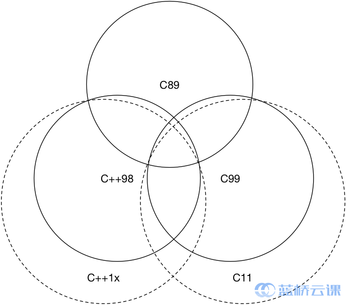

# C++11&14 高速上手教程

## 目录

[前往课程主页>](https://www.lanqiao.cn/courses/605)

[实验一  C++11&14简介](#实验1)

[实验二 语言可用性的强化](#实验2)

[实验三 语言运行期的强化](#实验3)

[实验四 对标准库的扩充：新增容器](#实验4)

[实验五 对标准库的扩充：智能指针和引用计数](#实验5)

[实验六 对标准库的扩充：正则表达式](#实验6)

[实验七 对标准库的扩充：语言级线程支持](#实验7)

[实验八 其他杂项](#实验8)

[实验九 扩展主题：C++17简介](#实验9)

## 实验1

C++11&14简介

C++98已经被实践证明了是一种非常成功的【范型】，而C++ 1x的出现，则进一步推动这种范型，让C++成为系统程序设计和库开发更好的语言。

```bash
$ g++ main.cpp -std=c++11

$ g++ main.cpp -std=c++14
```

从C++11开始，被弃用的主要特性如下：

1. 如果一个类有析构函数，为其生成拷贝构造函数和拷贝赋值运算符的特性被弃用了
2. 不允许字符串字面值常量赋值给一个`char*`，应该使用`const char*` 或者`auto`
3. C++98异常说明`unexpected_handler`、`set_unexpected`等相关特性被弃用，应该用`noexcept`
4. `auto_ptr`被弃用，应该使用`unique_ptr`
5. register关键字被弃用
6. bool类型的++操作被弃用
7. C语言风格的类型转换被弃用，应该使用`static_cast`、`reinterpret_cast`、`const_cast`来进行类型转换
8. 还有一些其他诸如参数绑定、export等特性也均被弃用

C和C++相关的兼容性情况：



【C++不是C的一个超集】（而且从一开始就不是）

在编写C++时，也应该尽可能地避免使用诸如`void*`之类地程序风格。

而在不得不使用C时，应该注意使用`extern "C"`这种特性，将C语言与C++代码进行分离编译，再统一链接这种做法。

头文件`foo.h`

```c
// foo.h
#ifdef __cplusplus
extern "C" {
#endif

int add(int x, int y);

#ifdef __cplusplus
}
#endif
```

源文件`foo.c`

```c
// foo.c
int add(int x, int y) {
    return x+y;
}
```

源文件`main.cpp`

```cpp
// main.cpp
#include "foo.h"
int main() {
    add(1, 2);
    return 0;
}
```

应先使用 `gcc` 编译 C 语言的代码：

```bash
gcc -c foo.c
```

编译出 foo.o 文件，再使用 `g++` 将 C++代码和 `.o` 文件链接起来（或者都编译为 `.o` 再统一链接）：

```bash
g++ main.cpp foo.o -o main
```

## 实验2

语言可用性的强化

nullptr

C++11引入了`nullptr`关键字，专门用来区分空指针、0

`nullptr`的类型为`nullptr_t`，能够隐式的转换为任何指针或成员指针的类型，也能和他们进行相等或者不等的比较

当需要使用`NULL`时候，请养成直接使用`nullptr`的习惯

constexpr

C++11提供了`constexpr`让用户显式的声明函数或对象构造函数在编译时会成为常数

此外，`constexpr`的函数可以使用递归：

```cpp
constexpr int fibonacci(const int n) {
    return n == 1 || n == 2 ? 1 : fibonacci(n-1)+fibonacci(n-2);
}
```

从 C++ 14 开始，`constexpr` 函数可以在内部使用局部变量、循环和分支等简单语句，但 C++ 11 中是不可以的。

类型推导

C++11 引入了`auto`和`decltype`这两个关键字实现了类型推导

```cpp
// 由于 cbegin() 将返回 vector<int>::const_iterator
// 所以 itr 也应该是 vector<int>::const_iterator 类型
for(auto itr = vec.cbegin(); itr != vec.cend(); ++itr);
```

注意：`auto` 不能用于函数传参（考虑重载的问题，我们应该使用模板）

decltype关键字是为了解决auto关键字只能对变量进行类型推导的缺陷而出现的

```cpp
auto x = 1;
auto y = 2;
decltype(x+y) z;   // z 是一个 int 型的
```

尾返回类型

```cpp
template<typename T, typename U>
auto add(T x, U y) -> decltype(x+y) {
    return x+y;
}
```

令人欣慰的是从 C++ 14 开始是可以直接让普通函数具备返回值推导，因此下面的写法变得合法：

```cpp
template<typename T, typename U>
auto add(T x, U y) {
    return x+y;
}
```

区间迭代

```cpp
// & 启用了引用, 如果没有则对 arr 中的元素只能读取不能修改
for(auto &i : arr) {
    std::cout << i << std::endl;
}
```

初始化列表

```cpp
#include <initializer_list>

class Magic {
public:
    Magic(std::initializer_list<int> list) {}
};

Magic magic = {1,2,3,4,5};
std::vector<int> v = {1, 2, 3, 4};
```

初始化列表除了用在对象构造上，还能将其作为普通函数的形参，例如：

```cpp
void func(std::initializer_list<int> list) {
    return;
}

func({1,2,3});
```

其次，C++11 提供了统一的语法来初始化任意的对象，例如：

```cpp
struct A {
    int a;
    float b;
};
struct B {

    B(int _a, float _b): a(_a), b(_b) {}
private:
    int a;
    float b;
};

A a {1, 1.1};    // 统一的初始化语法
B b {2, 2.2};
```

模板增强

C++11 引入了外部模板，扩充了原来的强制编译器在特定位置实例化模板的语法，使得能够显式的告诉编译器何时进行模板的实例化：

```cpp
template class std::vector<bool>;            // 强行实例化
extern template class std::vector<double>;  // 不在该编译文件中实例化模板
```

尖括号`>`

 C++ 11 开始，连续的右尖括号将变得合法，并且能够顺利通过编译。

类型别名模板

```cpp
typedef int (*process)(void *);  // 定义了一个返回类型为 int，参数为 void* 的函数指针类型，名字叫做 process
using process = int(*)(void *); // 同上, 更加直观

template <typename T>
using NewType = SuckType<int, T, 1>;    // 合法
```

默认模板参数

在 C++11 中提供了一种便利，可以指定模板的默认参数：

```cpp
template<typename T = int, typename U = int>
auto add(T x, U y) -> decltype(x+y) {
    return x+y;
}
```

变长参数模板

C++11 加入了新的表示方法，允许任意个数、任意类别的模板参数，同时也不需要在定义时将参数的个数固定

```cpp
template<typename... Args> void printf(const std::string &str, Args... args);
```

我们可以使用 `sizeof...` 来计算参数的个数

```cpp
template<typename... Args>
void magic(Args... args) {
    std::cout << sizeof...(args) << std::endl;
}
```

对参数进行解包，到目前为止还没有一种简单的方法能够处理参数包，但有两种经典的处理手法：

1）递归模板函数

```cpp
#include <iostream>
template<typename T>
void printf(T value) {
    std::cout << value << std::endl;
}
template<typename T, typename... Args>
void printf(T value, Args... args) {
    std::cout << value << std::endl;
    printf(args...);
}
int main() {
    printf(1, 2, "123", 1.1);
    return 0;
}
```


2）初始化列表展开

```cpp
// 编译这个代码需要开启 -std=c++14
// 因为版本原因，实验环境中的 g++ 尚不支持此特性，此处可以使用 clang++ 替代 g++
template<typename T, typename... Args>
auto print(T value, Args... args) {
    std::cout << value << std::endl;
    return std::initializer_list<T>{([&] {
        std::cout << args << std::endl;
    }(), value)...};
}
int main() {
    print(1, 2.1, "123");
    return 0;
}
```

面向对象增强

委托构造：C++ 11 引入了委托构造的概念，这使得构造函数可以在同一个类中一个构造函数调用另一个构造函数，从而达到简化代码的目的

继承构造：在传统 C++ 中，构造函数如果需要继承是需要将参数一一传递的，这将导致效率低下。C++ 11 利用关键字 using 引入了继承构造函数的概念

```cpp
class Base {
public:
    int value1;
    int value2;
    Base() {
        value1 = 1;
    }
    Base(int value) : Base() {                          // 委托 Base() 构造函数
        value2 = 2;
    }
};
class Subclass : public Base {
public:
    using Base::Base;  // 继承构造
};
int main() {
    Subclass s(3);
    std::cout << s.value1 << std::endl;
    std::cout << s.value2 << std::endl;
}
```

显式虚函数重载

当重载虚函数时，引入 `override` 关键字将显式的告知编译器进行重载，编译器将检查基函数是否存在这样的虚函数，否则将无法通过编译

`final` 则是为了防止类被继续继承以及终止虚函数继续重载引入的

显式禁用默认函数

C++11 允许显式的声明采用或拒绝编译器自带的函数。例如：

```cpp
class Magic {
public:
    Magic() = default;  // 显式声明使用编译器生成的构造
    Magic& operator=(const Magic&) = delete; // 显式声明拒绝编译器生成构造
    Magic(int magic_number);
}
```

强类型枚举

C++ 11 引入了枚举类（enumaration class），并使用 `enum class` 的语法进行声明：

```cpp
enum class new_enum : unsigned int {
    value1,
    value2,
    value3 = 100,
    value4 = 100
};
```

这样定义的枚举实现了类型安全，首先他不能够被隐式的转换为整数，同时也不能够将其与整数数字进行比较，更不可能对不同的枚举类型的枚举值进行比较。但相同枚举值之间如果指定的值相同，那么可以进行比较

而我们希望获得枚举值的值时，将必须显式的进行类型转换，不过我们可以通过重载 `<<` 这个算符来进行输出，可以收藏下面这个代码段：

```cpp
#include <iostream>
template<typename T>
std::ostream& operator<<(typename std::enable_if<std::is_enum<T>::value, std::ostream>::type& stream, const T& e)
{
    return stream << static_cast<typename std::underlying_type<T>::type>(e);
}
```

## 实验3

语言运行期的强化

Lambda表达式实际上就是提供了一个类似匿名函数的特性，而匿名函数则是在需要一个函数，但是又不想费力去命名一个函数的情况下去使用的

```cpp
[捕获列表](参数列表) mutable(可选) 异常属性 -> 返回类型 {
    // 函数体
}
```

```cpp
[ caputrue ] ( params ) opt -> ret { body; };
```

Lambda 表达式内部函数体在默认情况下是不能够使用函数体外部的变量的，这时候捕获列表可以起到传递外部数据的作用

值捕获

与参数传值类似，值捕获的前期是变量可以拷贝，不同之处则在于，被捕获的变量在 lambda 表达式被创建时拷贝，而非调用时才拷贝

```cpp
void learn_lambda_func_1() {
    int value_1 = 1;
    auto copy_value_1 = [value_1] {
        return value_1;
    };
    value_1 = 100;
    auto stored_value_1 = copy_value_1();
    // 这时, stored_value_1 == 1, 而 value_1 == 100.
    // 因为 copy_value_1 在创建时就保存了一份 value_1 的拷贝
    cout << "value_1 = " << value_1 << endl;
    cout << "stored_value_1 = " << stored_value_1 << endl;
}
```

引用捕获

与引用传参类似，引用捕获保存的是引用，值会发生变化

```cpp
void learn_lambda_func_2() {
    int value_2 = 1;
    auto copy_value_2 = [&value_2] {
        return value_2;
    };
    value_2 = 100;
    auto stored_value_2 = copy_value_2();
    // 这时, stored_value_2 == 100, value_1 == 100.
    // 因为 copy_value_2 保存的是引用
    cout << "value_2 = " << value_2 << endl;
    cout << "stored_value_2 = " << stored_value_2 << endl;
}
```

隐式捕获

手动书写捕获列表有时候是非常复杂的，这种机械性的工作可以交给编译器来处理，这时候可以在捕获列表中写一个 `&` 或 `=` 向编译器声明采用引用捕获或者值捕获

总结一下，捕获提供了 Lambda 表达式对外部值进行使用的功能，捕获列表的最常用的四种形式可以是：

- `[]` 空捕获列表
- `[name1, name2, ...]` 捕获一系列变量
- `[&]` 引用捕获, 让编译器自行推导捕获列表
- `[=]` 值捕获, 让编译器执行推导应用列表

函数对象包装器

C++11 `std::function` 是一种通用、多态的函数封装，它的实例可以对任何可以调用的目标实体进行存储、复制和调用操作，它也是对 C++中现有的可调用实体的一种类型安全的包裹（相对来说，函数指针的调用不是类型安全的）

`std::bind` 则是用来绑定函数调用的参数的，它解决的需求是我们有时候可能并不一定能够一次性获得调用某个函数的全部参数，通过这个函数，我们可以将部分调用参数提前绑定到函数身上成为一个新的对象，然后在参数齐全后，完成调用

右值引用

C++11 提供了 `std::move` 这个方法将左值参数无条件的转换为右值，有了它我们就能够方便的获得一个右值临时对象

```cpp
#include <iostream> // std::cout
#include <utility>  // std::move
#include <vector>   // std::vector
#include <string>   // std::string

int main() {

    std::string str = "Hello world.";
    std::vector<std::string> v;

    // 将使用 push_back(const T&), 即产生拷贝行为
    v.push_back(str);
    // 将输出 "str: Hello world."
    std::cout << "str: " << str << std::endl;

    // 将使用 push_back(const T&&), 不会出现拷贝行为
    // 而整个字符串会被移动到 vector 中，所以有时候 std::move 会用来减少拷贝出现的开销
    // 这步操作后, str 中的值会变为空
    v.push_back(std::move(str));
    // 将输出 "str: "
    std::cout << "str: " << str << std::endl;

    return 0;
}
```

## 实验4

使用 `std::array` 保存在栈内存中，相比堆内存中的 `std::vector`，我们就能够灵活的访问这里面的元素，从而获得更高的性能；同时正式由于其堆内存存储的特性，有些时候我们还需要自己负责释放这些资源

`std::array` 会在编译时创建一个固定大小的数组，`std::array` 不能够被隐式的转换成指针，使用 `std::array` 很简单，只需指定其类型和大小即可：

```cpp
std::array<int, 4> arr= {1,2,3,4};

int len = 4;
std::array<int, len> arr = {1,2,3,4}; // 非法, 数组大小参数必须是常量表达式
```

兼容C风格的接口：

```cpp
void foo(int *p, int len) {
    return;
}

std::array<int 4> arr = {1,2,3,4};

// C 风格接口传参
// foo(arr, arr.size());           // 非法, 无法隐式转换
foo(&arr[0], arr.size());
foo(arr.data(), arr.size());

// 使用 `std::sort`
std::sort(arr.begin(), arr.end());
```

`std::forward_list` 使用单向链表进行实现，提供了 `O(1)` 复杂度的元素插入，不支持快速随机访问（这也是链表的特点），也是标准库容器中唯一一个不提供 `size()` 方法的容器。当不需要双向迭代时，具有比 `std::list` 更高的空间利用率

## 实验5

`std::shared_ptr` 是一种智能指针，它能够记录多少个 `shared_ptr` 共同指向一个对象，从而消除显式调用 `delete`，当引用计数变为零的时候就会将对象自动删除

`std::make_shared` 就能够用来消除显示的使用 `new`，所以`std::make_shared` 会分配创建传入参数中的对象，并返回这个对象类型的`std::shared_ptr`指针

`std::unique_ptr` 是一种独占的智能指针，它禁止其他智能指针与其共享同一个对象，从而保证了代码的安全

## 实验6

正则表达式描述了一种字符串匹配的模式。一般使用正则表达式主要是实现下面三个需求：

1. 检查一个串是否包含某种形式的子串；
2. 将匹配的子串替换；
3. 从某个串中取出符合条件的子串

（1）普通字符

普通字符包括没有显式指定为元字符的所有可打印和不可打印字符。这包括所有大写和小写字母、所有数字、所有标点符号和一些其他符号。

（2）特殊字符

特殊字符是正则表达式里有特殊含义的字符，也是正则表达式的核心匹配语法。参见下表：

| 特别字符 | 描述                                                         |
| -------- | ------------------------------------------------------------ |
| `$`      | 匹配输入字符串的结尾位置。                                   |
| `(`,`)`  | 标记一个子表达式的开始和结束位置。子表达式可以获取供以后使用。 |
| `*`      | 匹配前面的子表达式零次或多次。                               |
| `+`      | 匹配前面的子表达式一次或多次。                               |
| `.`      | 匹配除换行符 `\n` 之外的任何单字符。                         |
| `[`      | 标记一个中括号表达式的开始。                                 |
| `?`      | 匹配前面的子表达式零次或一次，或指明一个非贪婪限定符。       |
| `\`      | 将下一个字符标记为或特殊字符、或原义字符、或向后引用、或八进制转义符。例如， `n` 匹配字符 `n`。`\n` 匹配换行符。序列 `\\` 匹配 `'\'` 字符，而 `\(` 则匹配 `'('` 字符。 |
| `^`      | 匹配输入字符串的开始位置，除非在方括号表达式中使用，此时它表示不接受该字符集合。 |
| `{`      | 标记限定符表达式的开始。                                     |
| \|       | 指明两项之间的一个选择。                                     |

（3）限定符

限定符用来指定正则表达式的一个给定的组件必须要出现多少次才能满足匹配。见下表：

| 字符    | 描述                                                         |
| ------- | ------------------------------------------------------------ |
| `*`     | 匹配前面的子表达式零次或多次。例如，`foo*` 能匹配 `fo` 以及 `foooo`。`*` 等价于`{0,}`。 |
| `+`     | 匹配前面的子表达式一次或多次。例如，`foo+` 能匹配 `foo` 以及 `foooo`，但不能匹配 `fo`。`+` 等价于 `{1,}`。 |
| `?`     | 匹配前面的子表达式零次或一次。例如，`Your(s)?` 可以匹配 `Your` 或 `Yours` 中的`Your` 。`?` 等价于 `{0,1}`。 |
| `{n}`   | `n` 是一个非负整数。匹配确定的 `n` 次。例如，`f{2}` 不能匹配 `for` 中的 `o`，但是能匹配 `foo` 中的两个 `o`。 |
| `{n,}`  | `n` 是一个非负整数。至少匹配 `n` 次。例如，`f{2,}` 不能匹配 `for` 中的 `o`，但能匹配 `foooooo` 中的所有 `o`。`o{1,}` 等价于 `o+`。`o{0,}` 则等价于 `o*`。 |
| `{n,m}` | `m` 和 `n` 均为非负整数，其中 `n` 小于等于 `m`。最少匹配 `n` 次且最多匹配 `m` 次。例如，`o{1,3}` 将匹配 `foooooo` 中的前三个 `o`。`o{0,1}` 等价于 `o?`。注意，在逗号和两个数之间不能有空格。 |

C++11 提供的正则表达式库操作 `std::string` 对象，模式 `std::regex` (本质是 `std::basic_regex`)进行初始化，通过 `std::regex_match` 进行匹配，从而产生 `std::smatch` （本质是 `std::match_results` 对象）

## 实验7

对标准库的扩充: 语言级线程支持

- std::thread
- std::mutex/std::unique_lock
- std::future/std::packaged_task
- std::condition_variable

```bash
g++ main.cpp -std=c++14 -pthread
```

`std::thread` 用于创建一个执行的线程实例，所以它是一切并发编程的基础，使用时需要包含头文件，它提供了很多基本的线程操作，例如`get_id()`来获取所创建线程的线程 ID，例如使用 `join()` 来加入一个线程等等

`std::mutex` 是 C++11 中最基本的 `mutex` 类，通过实例化 `std::mutex` 可以创建互斥量，而通过其成员函数 `lock()` 可以仅此能上锁，`unlock()` 可以进行解锁

```cpp
#include <iostream>
#include <thread>
#include <mutex>

std::mutex mtx;

void block_area() {
    std::unique_lock<std::mutex> lock(mtx);
    //...临界区
}
int main() {
    std::thread thd1(block_area);

    thd1.join();

    return 0;
}
```

C++11 提供的 `std::future` 可以用来获取异步任务的结果。自然地，我们很容易能够想象到把它作为一种简单的线程同步手段。

此外，`std::packaged_task` 可以用来封装任何可以调用的目标，从而用于实现异步的调用

```cpp
#include <iostream>
#include <future>
#include <thread>

int main() {
    // 将一个返回值为7的 lambda 表达式封装到 task 中
    // std::packaged_task 的模板参数为要封装函数的类型
    std::packaged_task<int()> task([](){return 7;});
    // 获得 task 的 future
    std::future<int> result = task.get_future();    // 在一个线程中执行 task
    std::thread(std::move(task)).detach();    std::cout << "Waiting...";
    result.wait();
    // 输出执行结果
    std::cout << "Done!" << std:: endl << "Result is " << result.get() << '\n';
}
```

在封装好要调用的目标后，可以使用 `get_future()` 来获得一个 `std::future` 对象，以便之后事实线程同步

`std::condition_variable` 是为了解决死锁而生的。当互斥操作不够用而引入的。比如，线程可能需要等待某个条件为真才能继续执行，而一个忙等待循环中可能会导致所有其他线程都无法进入临界区使得条件为真时，就会发生死锁。所以，`condition_variable` 实例被创建出现主要就是用于唤醒等待线程从而避免死锁。`std::condition_variable`的 `notify_one()` 用于唤醒一个线程；`notify_all()` 则是通知所有线程

生产者和消费者模型：

```cpp
#include <condition_variable>
#include <mutex>
#include <thread>
#include <iostream>
#include <queue>
#include <chrono>

int main()
{
    // 生产者数量
    std::queue<int> produced_nums;
    // 互斥锁
    std::mutex m;
    // 条件变量
    std::condition_variable cond_var;
    // 结束标志
    bool done = false;
    // 通知标志
    bool notified = false;

    // 生产者线程
    std::thread producer([&]() {
        for (int i = 0; i < 5; ++i) {
            std::this_thread::sleep_for(std::chrono::seconds(1));
            // 创建互斥锁
            std::unique_lock<std::mutex> lock(m);
            std::cout << "producing " << i << '\n';
            produced_nums.push(i);
            notified = true;
            // 通知一个线程
            cond_var.notify_one();
        }
        done = true;
        cond_var.notify_one();
    });
  
    // 消费者线程
    std::thread consumer([&]() {
        std::unique_lock<std::mutex> lock(m);
        while (!done) {
            while (!notified) {  // 循环避免虚假唤醒
                cond_var.wait(lock);
            }
            while (!produced_nums.empty()) {
                std::cout << "consuming " << produced_nums.front() << '\n';
                produced_nums.pop();
            }
            notified = false;
        }
    });

    producer.join();
    consumer.join();
}
```

## 实验8

`long long int` 并不是 C++11 最先引入的，其实早在 C99，`long long int` 就已经被纳入 C 标准中，所以大部分的编译器早已支持。C++11 的工作则是正式把它纳入标准库，规定了一个 `long long int` 类型至少具备 64 位的比特数

C++ 11 将异常的声明简化为以下两种情况：

1. 函数可能抛出任何异常
2. 函数不能抛出任何异常

使用`noexcept`对这两种行为进行限制

```cpp
void may_throw();           // 可能抛出异常
void no_throw() noexcept;   // 不可能抛出异常
```

使用 `noexcept` 修饰过的函数如果抛出异常，编译器会使用 `std::terminate()` 来立即终止程序运行

`noexcept` 还能用作操作符，用于操作一个表达式，当表达式无异常时，返回 `true`，否则返回 `false`

`noexcept` 修饰完一个函数之后能够起到封锁异常扩散的功效，如果内部产生异常，外部也不会触发

C++11 提供了原始字符串字面量的写法，可以在一个字符串前方使用 `R` 来修饰这个字符串，同时，将原始字符串使用括号包裹

```cpp
#include <iostream>
#include <string>

int main() {
    std::string str = R"(C:\\What\\The\\Fxxk)";
    std::cout << str << std::endl;
    return 0;
}
```

## 实验9

C++17 打破了这一限制，让我们能够在非类型模板参数中使用 `auto` 关键字，从而让编译器推导具体的类型：

```cpp
template <auto value> void foo() {
    return;
}

foo<10>();  // value 被推导为 int 类型
```

C++17 正式将 `variant<>` 纳入标准库

结构化绑定提供了类似其他语言中提供的多返回值的功能

```cpp
std::tuple<int,double,std::string> f() {
    return std::make_tuple(1,2.3,"456");
}
auto [x,y,z] = f(); // x,y,z 分别被推导为int,double,std::string
```

